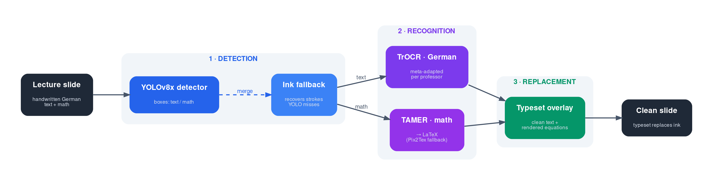
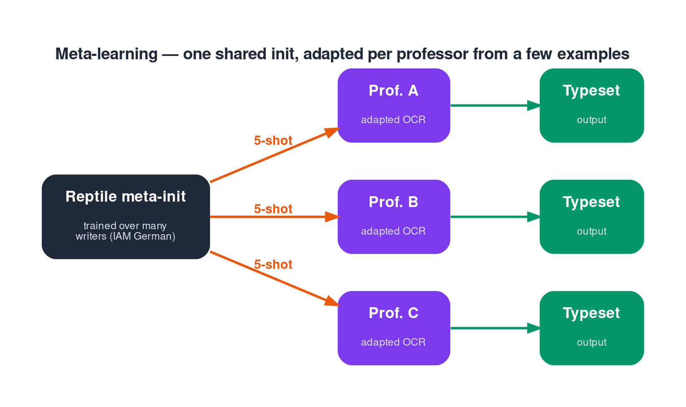
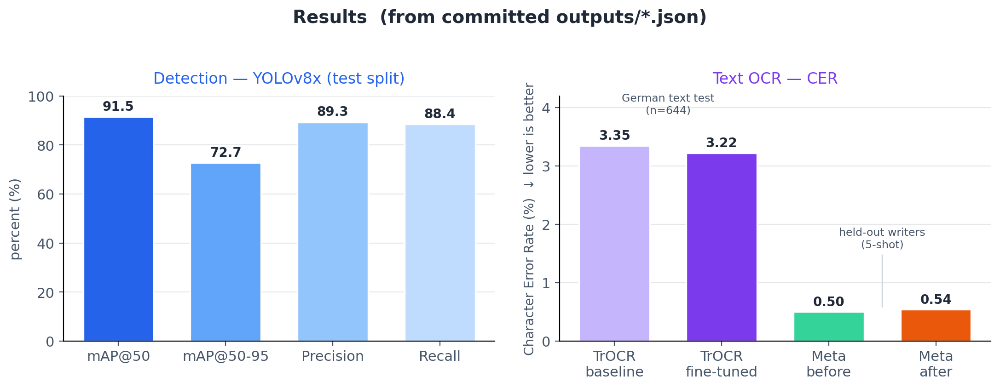

# ink2digital

**German lecture-slide handwriting → clean typeset text & math, with meta-learning for per-professor adaptation.**

University lecturers annotate their slides by hand — deriving an equation in the margin, correcting a
definition, sketching a step. `ink2digital` takes a photographed slide, **finds** the handwritten
regions, **recognises** the German text and mathematics, and **replaces** the ink with clean, typeset
equivalents. Because every professor writes differently, the recogniser is trained with **meta-learning**
so it can adapt to a new person's handwriting from only a handful of examples.

---

## Pipeline



The system is three stages:

1. **Detection** — a YOLOv8x detector locates `text` and `math` regions. A lightweight ink-based
   fallback recovers handwritten strokes the detector misses on cluttered slide backgrounds.
2. **Recognition** — German handwritten text goes to a fine-tuned **TrOCR** model; handwritten
   mathematics goes to **TAMER** (with a Pix2Tex fallback), which outputs LaTeX.
3. **Replacement** — the recognised content is typeset and overlaid back onto the slide.

---

## Meta-learning



Instead of training a separate model per lecturer, we train a single shared initialisation with
**Reptile** (a first-order meta-learning algorithm) across many writers. At deployment, that init is
fine-tuned on a small *support set* of a new professor's handwriting (e.g. 5 examples) to specialise to
their style — the goal being a system that works for *any* lecturer, not just the one it was built on.

---

## What was done

| Phase | Work | Outcome |
|-------|------|---------|
| 1 | Baseline pipeline: off-the-shelf YOLOv8 + TrOCR + Pix2Tex | End-to-end prototype |
| 2 | Fine-tune TrOCR on German handwriting; add TAMER for math | Strong text + math recognition |
| 3 | Reptile meta-learning for per-professor adaptation | Few-shot adaptation framework |
| 4 | Integration into a single `infer.py` runner (detect → recognise → replace) | Working demo on real slides |

---

## Results



All numbers below come from the evaluation JSONs committed under [`outputs/`](outputs/).

| Stage | Model | Test set | Metric | Value |
|-------|-------|----------|--------|-------|
| Detection | YOLOv8x | detection test split | mAP@50 / mAP@50-95 | **91.5%** / 72.7% (P 0.89, R 0.88) |
| Text OCR | TrOCR-large-handwritten (baseline) | German text, n = 644 | CER / WER | 3.35% / 4.54% |
| Text OCR | TrOCR fine-tuned | German text, n = 644 | CER / WER | **3.22%** / 4.70% |
| Meta-learning | Reptile, 5-shot, 10 held-out writers | meta-test | CER before → after | 0.50% → 0.54% |

**Reading the results honestly.** Detection is strong. On the 644-sample German text set, fine-tuning
roughly *matched* an already-strong handwriting baseline. And 5-shot adaptation on held-out writers was
essentially flat (a slight increase). That last result is not a flaw in the method — it is what
few-shot adaptation looks like when the per-writer signal is small at this **data scale**. It is the
clearest motivation for the data work described next.

---

## Datasets & the data-scarcity problem

There is **no public dataset for the actual target task** — photographed lecture slides carrying
*handwritten German text and mathematics*, with region annotations and verified transcriptions. So
every model here was trained on the closest available **proxy** dataset:

| Used for | Dataset | Why it is only a proxy |
|----------|---------|------------------------|
| Detector (`text` / `math` regions) | **DocLayNet** | Layout of *printed* documents — not handwriting, not photographed slides |
| German text recognition + meta-learning | **IAM Handwriting DB** (German-writer subset) | Clean single-writer forms on plain paper — no slide clutter, limited STEM vocabulary |
| Math recognition | **CROHME** (via TAMER) | Isolated handwritten expressions on clean backgrounds — not in-the-wild slide math |

We chose these because they were the largest, cleanest, publicly available stand-ins — not because they
match deployment. Each leaves a **domain gap** between training and the real task.

**What "relevant" data would mean.** Data drawn from the same distribution as deployment:

- **Photographed lecture slides**, with their real imaging conditions — perspective, lighting,
  compression artefacts, and *printed content sitting behind the ink*.
- **Real professor handwriting**, across many writers and with enough examples *per writer* to make
  few-shot adaptation meaningful.
- **German technical/mathematical vocabulary** and **mixed text + math layout**, as it actually appears
  on slides.
- **Aligned labels**: bounding boxes for text/math regions *and* ground-truth transcriptions.

This is exactly the `LectureSlideOCR-500-DE` benchmark sketched in
[`scripts/build_lecture_dataset.py`](scripts/build_lecture_dataset.py).

**Why more relevant data helps every component.** With in-domain data:

- the **detector** learns to find handwriting against busy printed slide backgrounds, where a
  layout-trained detector currently struggles;
- **TrOCR** sees German STEM vocabulary under real slide imaging conditions rather than clean forms;
- **TAMER** sees handwritten math in context instead of isolated, clean expressions;
- **meta-learning** gets more writers and more shots per writer — the conditions under which few-shot
  adaptation actually pays off (and the flat 5-shot result above would be expected to improve).

In short: the methods are in place; the main lever left is **relevant, in-domain data**.

---

## Repository structure

```
├── baseline/      # Phase 1: off-the-shelf pipeline (YOLOv8 + TrOCR + Pix2Tex)
├── models/        # Model wrappers (TAMER math OCR, DLAFormer, Reptile/MAML OCR)
├── training/      # Training scripts (detector, TrOCR fine-tuning, meta-learning)
├── evaluate/      # Evaluation (mAP, CER/WER, math, end-to-end)
├── scripts/       # Dataset preparation (IAM, DocLayNet, CROHME) + benchmark builder
├── utils/         # Metrics, image utilities, German post-processing
├── configs/       # YAML configs (detection, meta-training, full pipeline)
├── TAMER/         # Math OCR (git submodule; pre-trained on CROHME)
├── outputs/       # Evaluation results (JSON)
└── infer.py       # End-to-end runner: detect → recognise → replace
```

> **Note:** trained model weights and the private professor-slide data are **not** included in this
> repository (they are gitignored). The code, configs, and evaluation results are provided.

---

## Setup

```bash
git clone https://github.com/ragav1n/ink2digital.git
cd ink2digital
git submodule update --init --recursive      # restores TAMER/

python3 -m venv venv
source venv/bin/activate
pip install -r requirements_project.txt
pip install ultralytics                       # YOLOv8 detector
```

### Running the pipeline

```bash
python infer.py \
    --detector-path <path/to/detector.pt> \
    --image-dir   <path/to/slide_images/> \
    --output-dir  outputs/run1/
```

(Provide your own trained detector/OCR checkpoints — see `training/` to reproduce them.)

---

## Future work

The headline takeaway is a **data** one. The model stack works; the ceiling is set by the lack of
in-domain data. Priorities:

1. **Build `LectureSlideOCR-500-DE`** — annotated, photographed German lecture slides with text/math
   boxes and verified transcriptions, split per professor for few-shot evaluation.
2. **More writers, more shots per writer** so meta-learning adaptation has signal to learn from.
3. **Retrain the detector on real slides** to close the printed-layout → handwritten-slide domain gap.
4. **A formal end-to-end benchmark** (detection + recognition + replacement) on that data.

---

## Acknowledgements

Built on the **IAM Handwriting Database**, **DocLayNet**, the **CROHME** math benchmark, **TAMER**,
Microsoft **TrOCR**, and Ultralytics **YOLOv8**. Models were trained on NVIDIA V100 / RTX 4060 Ti GPUs.
